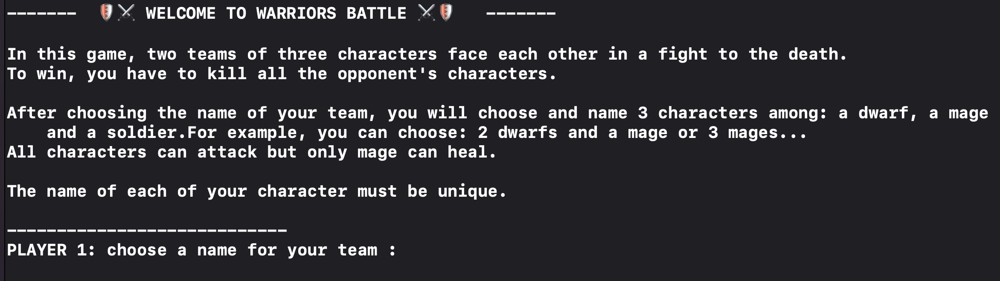
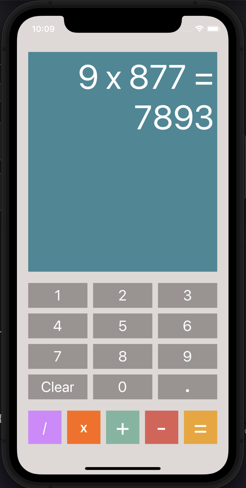
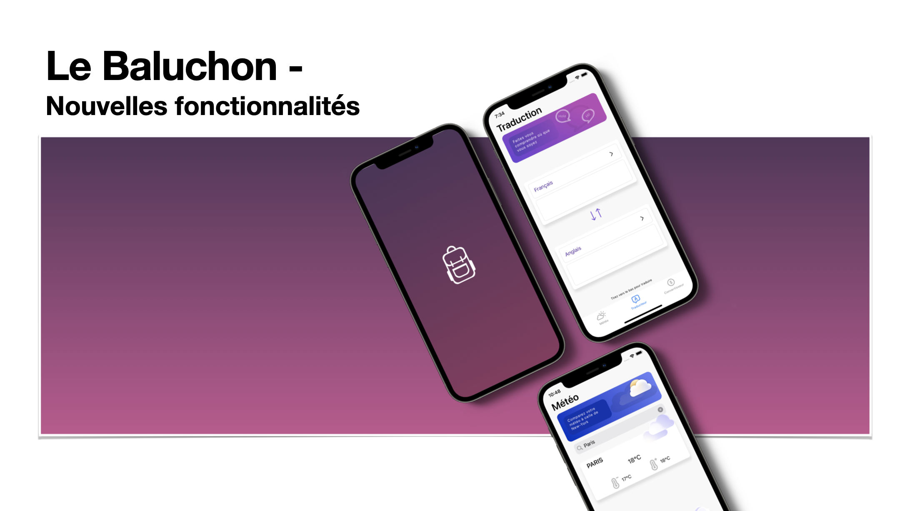
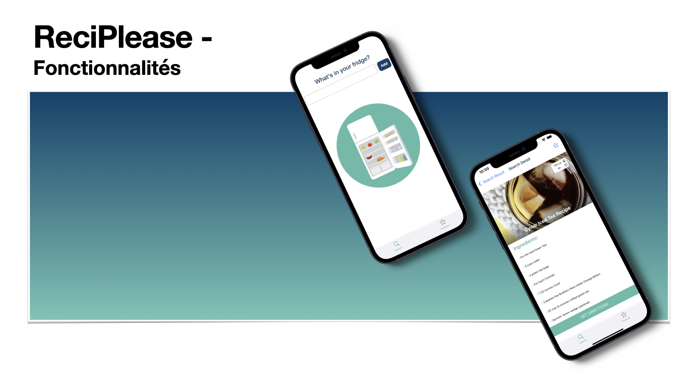
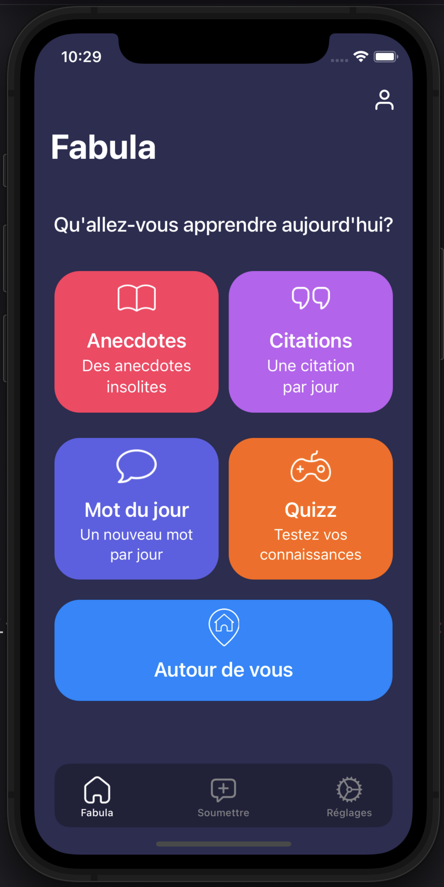

# Projets-OpenClassrooms

Présentation des projets réalisés dans le cadre de la formation développeur iOS d'OpenClassrooms:

- Projet 3: réalisation d'un jeux de combat au tour le tour.

- Projet 4: réalisation d'une application de montage photo.
- Projet 5: réalisation et amélioration d'une application calculatrice.

- Projet 6: rédaction des spécifications fonctionnelles du site internet d'un restaurant.
- Projet 7: rédaction des spécifications techniques, du modèle physique de données et de la base de données PostgreSQL du site internet d'un restaurant.
- Projet 8: rédaction du dossier de conception fonctionnelle, du dossier de conception technique et du dossier d'exploitation du site internet d'un restaurant.
- Projet 9: réalisation d'une application de voyage.

- Projet 10: réalisation d'une application de recette de cuisine.

- Projet 12: réalisation d'une application de culture générale. 

